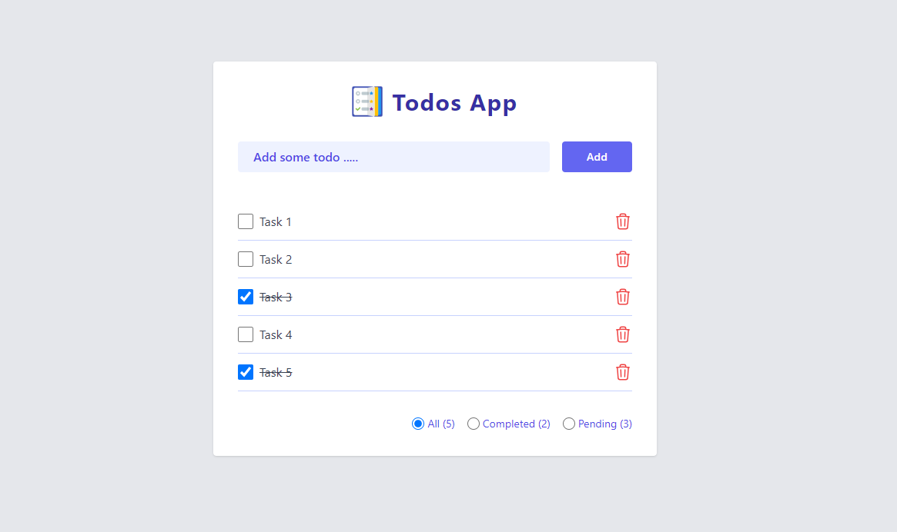

# Simple Todo List Web App with Vue Js & Tailwind CSS

This repository contains a simple and elegant Todo List web app built using Tailwind CSS and JavaScript. The app allows users to create, manage, and save todos, all while enjoying a beautiful user interface design.

## Screeshots


## Key Features
* Add new todos with a user-friendly interface.
* Beautiful design and interface.
* Mark todos as completed.
* Delete completed todos or those no longer needed.
* Change to-dos status
* Filter to-dos by status

## Planned Features
* Set task due Dates and Times.
* Set priority for your tasks.
* User registration.(Sign Up)
* User login / social login (Google)
* Filter to-dos by status
* Task Tags
* Dark Mode

## Technologies Used
* HTML5: The structure of the web app.
* CSS3 with Tailwind CSS: For styling the app beautifully.
* Vue Js: To handle the interactive functionality of the app.
* Pinia for state management
* Sweet Alert 2 for toast notification

### Compile and Hot-Reload for Development

```sh
npm run dev
```

### Compile and Minify for Production

```sh
npm run build
```
